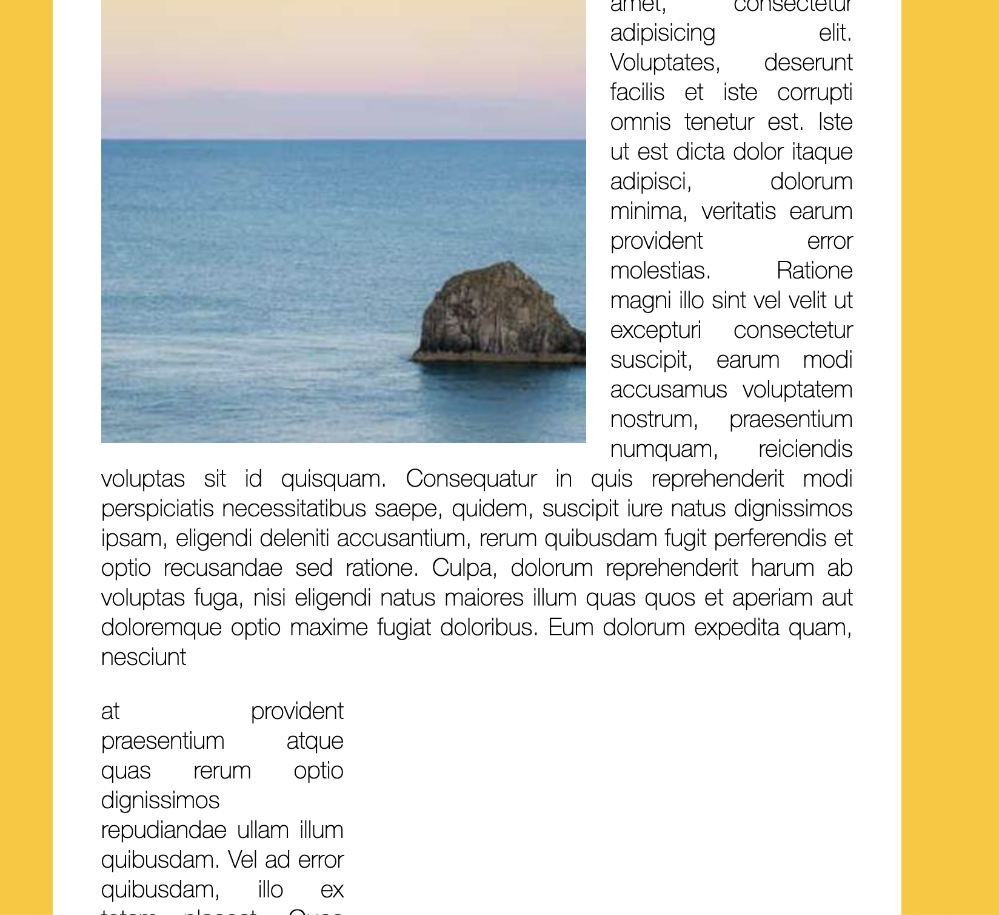

# slide_in_on_scroll

This is a 30-days javascript grinding  
js30 [https://github.com/ningh98/js30]  
13. Slide in on Scroll [https://github.com/ningh98/slide_in_on_scroll]

## Table of contents

- [Overview](#overview)
  - [Screenshot](#screenshot)
  - [Links](#links)
- [My process](#my-process)
  - [Built with](#built-with)
  - [What I learned](#what-i-learned)


## Overview

This HTML and JavaScript code demonstrates how to create a smooth scroll-triggered image animation effect. As the user scrolls down the page, images slide in and become fully visible when they are halfway into view.

### Screenshot




### Links

- Live Site URL: [https://ningh98.github.io/slide_in_on_scroll/]

## My process

### Built with

- HTML
- CSS
- Javascript


### What I learned


```js

const sliderImages = document.querySelectorAll('.slide-in')

function checkSlide(e){
    
    sliderImages.forEach(sliderImage => {
      // half way through the image
      const slideInAt = (window.scrollY + window.innerHeight) - sliderImage.height / 2
      // bottom of the image
      const imageBottom = sliderImage.offsetTop + sliderImage.height
      const isHalfShown = slideInAt > sliderImage.offsetTop
      const isNotScrolledPast = window.scrollY < imageBottom
      if (isHalfShown && isNotScrolledPast){
        sliderImage.classList.add('active')
      } else {
        sliderImage.classList.remove('active')
      }
    })
  }

window.addEventListener('scroll', debounce(checkSlide))
```


